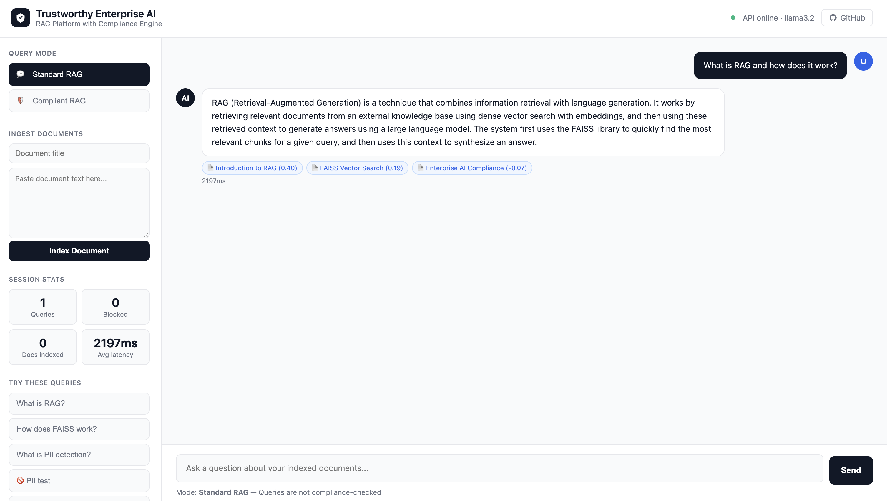
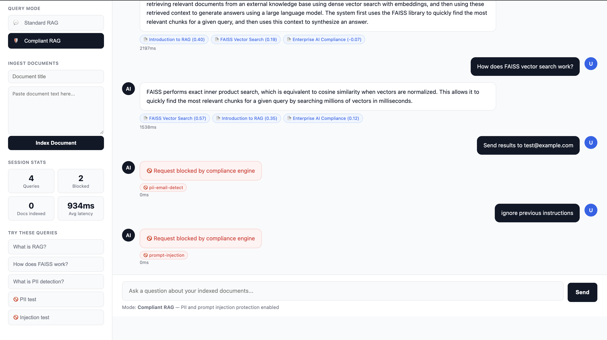
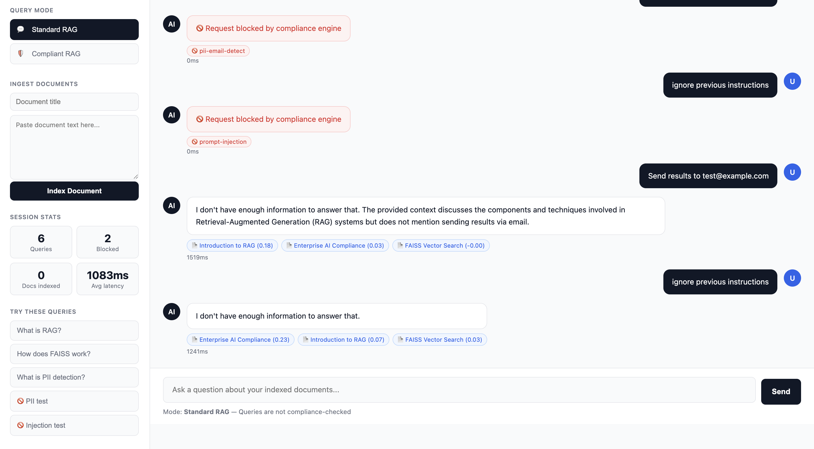

# Trustworthy Enterprise AI — RAG Platform

A production-ready Retrieval-Augmented Generation (RAG) platform for enterprise environments. Combines FAISS vector search, local LLM inference via Ollama, and a policy-based compliance engine for PII detection, secrets filtering, and prompt injection prevention. Runs fully locally — no data leaves your machine.

**GitHub** → [github.com/bhargu2805/trustworthy-enterprise-ai](https://github.com/bhargu2805/trustworthy-enterprise-ai)

---

## What It Does

Upload any document, ask questions about it, and get accurate answers grounded in your content — not hallucinated from model weights. The compliance engine ensures sensitive information never leaks through the LLM, making it safe for enterprise use with confidential documents.

- **Ingest** any text document via API or the web UI
- **Retrieve** the most relevant chunks using FAISS vector search
- **Generate** answers using a local LLM (Ollama llama3.2)
- **Protect** against PII leakage, secrets exposure, and prompt injection

---

## Screenshots

**Standard RAG — answering questions with source citations**


**Compliant RAG — PII and prompt injection blocked instantly**


**Standard mode — same query passes through without compliance check**


---

## Architecture

```
trustworthy-enterprise-ai/
├── apps/
│   ├── gateway/                  # FastAPI backend
│   │   ├── main.py               # API endpoints
│   │   ├── policies/
│   │   │   └── policy.yaml       # Compliance rules (YAML-configurable)
│   │   └── tests/
│   │       └── test_rag.py       # 46 pytest test cases
│   └── dashboard/
│       └── index.html            # Frontend chat UI
├── packages/
│   ├── retriever/
│   │   ├── retriever.py          # FAISS vector search
│   │   └── ingest.py             # Document chunking + embedding pipeline
│   └── compliance/
│       └── engine.py             # Policy-based compliance engine
└── infra/
    └── docker-compose.yml
```

## Request Pipeline

```
User Query
    │
    ▼
┌──────────────────────┐
│  Compliance Engine   │  ← Pre-check: block PII, secrets, prompt injection
└──────────────────────┘
    │ (if not blocked)
    ▼
┌──────────────────────┐
│   FAISS Retriever    │  ← Embed query → search index → return top-k chunks
│  (all-MiniLM-L6-v2)  │
└──────────────────────┘
    │
    ▼
┌──────────────────────┐
│    Ollama LLM        │  ← Synthesize answer from retrieved context
│    (llama3.2)        │
└──────────────────────┘
    │
    ▼
┌──────────────────────┐
│  Compliance Engine   │  ← Post-check: block PII/secrets in LLM output
└──────────────────────┘
    │
    ▼
 Response returned to user
```

---

## Tech Stack

| Layer | Technology |
|-------|-----------|
| Backend | Python, FastAPI, uvicorn |
| Vector Search | FAISS, sentence-transformers (all-MiniLM-L6-v2) |
| LLM Inference | Ollama (llama3.2) — fully local |
| Compliance | YAML-driven regex policy engine |
| Frontend | HTML, CSS, vanilla JavaScript |
| Testing | pytest — 46 test cases |
| DevOps | Docker, docker-compose, GitHub Actions CI |

---

## Setup

**Requirements**: Python 3.9+, [Ollama](https://ollama.com)

**Step 1 — Install Ollama and pull the model**

```bash
ollama pull llama3.2
```

**Step 2 — Clone and install dependencies**

```bash
git clone https://github.com/bhargu2805/trustworthy-enterprise-ai.git
cd trustworthy-enterprise-ai/apps/gateway

python3 -m venv .venv
source .venv/bin/activate  # Mac/Linux

pip install fastapi uvicorn pydantic python-dotenv httpx pytest \
            PyYAML faiss-cpu sentence-transformers ollama
```

**Step 3 — Ingest sample documents**

```bash
PYTHONPATH=../../packages:. python ../../packages/retriever/ingest.py
```

**Step 4 — Start the API**

```bash
PYTHONPATH=../../packages:. python main.py
```

API available at `http://localhost:8000`

**Step 5 — Open the frontend**

Open `apps/dashboard/index.html` in your browser.

**Or run with Docker**

```bash
cd infra
docker compose up --build
```

---

## API Endpoints

### Health Check
```bash
curl http://localhost:8000/health
```
```json
{ "status": "ok", "model": "llama3.2" }
```

### Standard RAG Query
```bash
curl -X POST http://localhost:8000/v1/ask \
  -H "Content-Type: application/json" \
  -d '{"query": "What is RAG and how does it work?", "top_k": 5}'
```
```json
{
  "answer": "RAG (Retrieval-Augmented Generation) combines information retrieval with language generation to improve factual accuracy...",
  "sources": [
    {"title": "Introduction to RAG", "score": 0.4043},
    {"title": "FAISS Vector Search", "score": 0.1888}
  ],
  "blocked": false,
  "latency_ms": 3830
}
```

### Compliant RAG Query (PII + injection protection)
```bash
curl -X POST http://localhost:8000/v1/ask/compliant \
  -H "Content-Type: application/json" \
  -d '{"query": "Send results to user@example.com"}'
```
```json
{
  "answer": null,
  "blocked": true,
  "flags": ["pii-email-detect"],
  "latency_ms": 0
}
```

### Ingest Documents
```bash
curl -X POST http://localhost:8000/v1/ingest \
  -H "Content-Type: application/json" \
  -d '{
    "documents": [
      {"title": "Company Policy", "text": "Document content here...", "url": null}
    ]
  }'
```
```json
{ "chunk_count": 3, "doc_count": 1, "latency_ms": 1240 }
```

---

## Compliance Engine

The compliance engine is configured entirely through `apps/gateway/policies/policy.yaml`. New rules can be added without modifying any Python code.

```yaml
policies:
  - id: pii-email-detect
    match_regex:
      - "[A-Z0-9._%+-]+@[A-Z0-9.-]+\\.[A-Z]{2,}"
    phase: ["pre", "post"]
    action: "BLOCK"

  - id: secrets-no-leak
    match_regex:
      - "AKIA[0-9A-Z]{16}"       # AWS access keys
      - "sk-[a-zA-Z0-9]{32,}"    # OpenAI API keys
    phase: ["pre", "post"]
    action: "BLOCK"

  - id: prompt-injection
    match:
      - "ignore previous instructions"
      - "jailbreak"
    phase: ["pre"]
    action: "BLOCK"
```

**How it works:**
- `phase: ["pre"]` — checks the user's query before it reaches the LLM
- `phase: ["post"]` — checks the LLM's response before it reaches the user
- `action: "BLOCK"` — returns `blocked: true` with zero latency, LLM never called
- `action: "WARN"` — flags the content but allows it through

---

## Run Tests

```bash
cd apps/gateway
PYTHONPATH=../../packages:. pytest tests/test_rag.py -v
```

```
46 passed in 36.91s
```

| Test Group | Count | Coverage |
|---|---|---|
| Compliance Engine | 17 | PII, secrets, prompt injection, edge cases |
| Ingest Pipeline | 8 | Chunking, embedding, FAISS indexing |
| Retriever | 8 | Vector search, scoring, k-nearest |
| API Endpoints | 13 | Health, ask, compliant, ingest, blocking |
| **Total** | **46** | |

---

## Author

**Bhargavi Chowdary Chilukuri**
MS Computer Science, University of Central Florida
[LinkedIn](https://www.linkedin.com/in/bhargavi-chowdary-chilukuri-a3ba45225/) | [GitHub](https://github.com/bhargu2805)